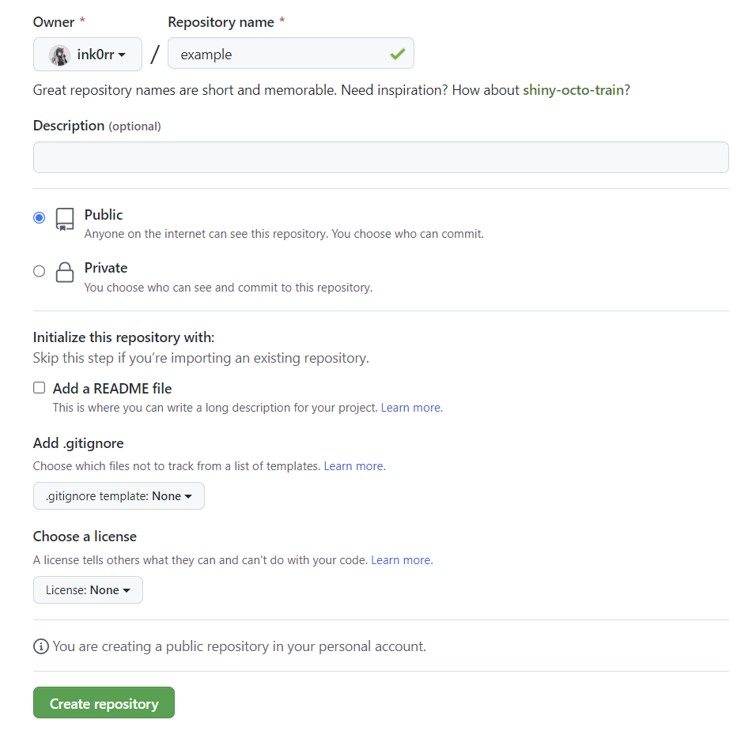
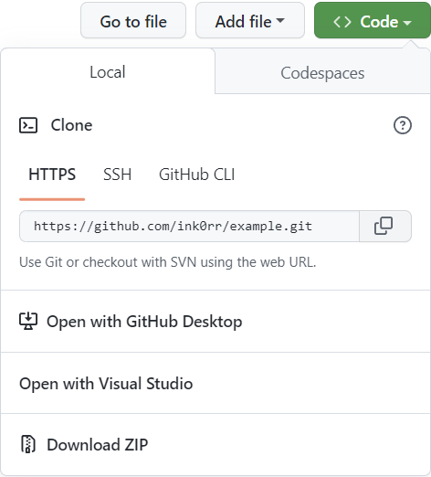
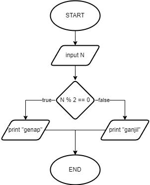
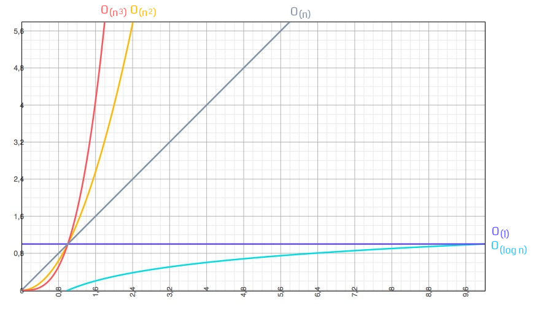

# Writing and Presentation Test Week #1

## Unix Command Line

- ### Shell

  Shell adalah program yang menyediakan komunikasi langsung antara pengguna atau program lain ke sistem operasi. Pada umumnyam shell menggunakan command-line interface (CLI) atau graphical user interface (GUI) untuk berkomunikasi. Dinamakan demikian karena shell adalah layar terluar dari sebuah sistem operasi.

- ### File System Structure

  File System mengatur bagaimana data disimpan di dalam sebuah sistem. Sistem operasi Windows & Unix-like menyusun file dan direktori menggunakan struktur yang bentuknya mirip dengan tree.

- ### Basic Commands

  - `pwd` untuk melihat current working directory
  - `ls` untuk melihat isi directory
  - `cd` untuk berpindah directory
  - `cat` untuk melihat isi file
  - `touch` untuk membuat file
  - `mkdir` untuk membuat directory
  - `cp` untuk menyalin file & directory
  - `mv` untuk memindahkan atau mengubah nama file & directory
  - `rm` untuk menghapus file & directory

## Git & GitHub Dasar

- ### Git

  Git adalah Version Control System yang dapat mencatat perubahan-perubahan file dalam suatu proyek. Git dikenal juga sebagai Distributed Version Control, artinya penyimpanan database Git tidak hanya berada dalam satu tempat saja.

- ### GitHub

  GitHub merupakan layanan cloud yang berguna untuk menyimpan dan mengelola sebuah git repository.

- ### Mengapa perlu menggunakan Git & GitHub?

  Git & GitHub digunakan untuk menyimpan source code untuk suatu proyek dan melacak riwayat lengkap semua perubahan kode tersebut. Git & GitHub juga dapat memudahkan kita untuk bekerja sama dalam sebuah tim.

- ### Cara membuat repository Git & GitHub

  Buat repository baru pada https://github.com/new. Masukkan nama respository lalu tekan `Create repository`

  

  Lalu jalankan command dibawah pada folder proyek yang ingin diupload ke GitHub

  ```
  $ git init
  $ git add .
  $ git commit -m "commit message"
  $ git branch -M main
  $ git remote add origin https://github.com/ink0rr/example.git
  $ git push -u origin main
  ```

- ### Cara melakukan cloning pada repository GitHub

  Buka repository yang ada pada GitHub lalu tekan tombol `Code` yang terletak di kanan atas lalu copy link HTTPS yang muncul.

  

  Lalu jalankan command dibawah pada directory yang ingin kita gunakan untuk menyimpan proyek tersebut

  ```
  $ git clone https://github.com/ink0rr/example.git
  ```

## HTML

HyperText Markup Language atau HTML adalah bahasa markup standar untuk dokumen yang didesain untuk ditampilkan dalam web browser. HTML dapat dibantu oleh teknologi seperti Cascading Style Sheets (CSS) dan bahasa skrip seperti JavaScript.

- ### HTML element anatomy

  

  Sebuah elemen terdiri dari:

  - Opening Tag: Terdiri atas nama elemen (pada contoh diatas, p), yang dibungkus dalam kurung sudut. Ini menyatakan di mana elemen dimulai.
  - Closing Tag: Sama seperti opening tag, namun tag ini menyertakan garis miring ke depan sebelum nama elemen. Closing tag menyatakan di mana elemen berakhir.
  - Content: Ini adalah konten elemen, pada contoh diatas, hanya berupa teks.

  

  Attribute berisi informasi tambahan tentang sebuah elemen. Pada contoh diatas, `class` adalah nama attribute dan `"editor-note"` adalah nilai attribute.

  ```html
  
  ```

  Beberapa elemen tidak memiliki konten sama sekali. Elemen tersebut dinamakan `Empty Element`. Dalam contoh diatas, elemen `img` memiliki 2 attribute namun tidak memiliki closing tag `</img>`, dan tidak memiliki konten. Beberapa contoh empty element lain adalah:

  - `<br />`
  - `<link />`
  - `<meta />`
  - dll.

- ### Struktur dasar HTML

  Struktur dasar dokumen HTML adalah sebagai berikut

  ```html
  <!DOCTYPE html>
  <html lang="en">
    <head>
      <meta charset="UTF-8" />
      <meta name="viewport" content="width=device-width, initial-scale=1.0" />
      <title>Document Title</title>
    </head>
    <body>
      Document Body
    </body>
  </html>
  ```

  HTML tersusun sebagai kesatuan dari sebuah family tree relationship. Saat sebuah element berada di dalam element lain, maka disebut child element. Element yang memiliki element lain di dalamnya disebut parent element.

  Dalam contoh diatas, kita mempunyai:

  - `<html></html>`: Merepresentasikan root dari sebuah dokumen HTML
  - `<head></head>`: Sebagai penampung elemen-elemen yang bukan merupakan konten yang ingin dilihat pengguna.
  - `<meta charset="UTF-8" />`: Menetapkan set karakter yang harus digunakan ke UTF-8 yang mencakup sebagian besar karakter dari sebagian besar bahasa tertulis. Tidak ada alasan untuk tidak menetapkan ini dan ini dapat membantu menghindari beberapa masalah di kemudian hari.
  - `<meta name="viewport" content="width=device-width, initial-scale=1.0" />`: Elemen ini memastikan halaman dirender sesuai lebar viewport, mencegah browser mobile merender halaman yang lebih lebar dari viewport dan kemudian mengecilkannya.
  - `<title></title>`: Menetapkan judul dari halaman yang akan muncul pada tab browser.
  - `<body></body>`: Berisikan seluruh konten yang akan dilihat oleh pengguna.

- ### Semantic Element

  Semantic element adalah elemen dengan nama yang dengan jelas mendeskripsikan maksud dan kegunaan elemen tersebut.

  Contoh element non-semantic adalah `<div>` dan `<span>` - Element tersebut tidak mendeskripsikan konten apa yang akan ditampilkan.

  Contoh element semantic adalah `<form>`, `<table>`, dan `<article>` - Element tersebut memiliki nama yang jelas mendeskripsikan konten apa yang akan ditampilkan.

  Banyak website yang memiliki code HTML seperti `<div id="nav">`, `<div class="header">`, `<div id="footer">` untuk mengindikasikan navbar, header, dan footer. HTML memiliki beberapa semantic element yang dapat digunakan untuk membuat berbagai bagian dalam sebuah website seperti:

  - `<article>`
  - `<footer>`
  - `<header>`
  - `<nav>`
  - `<section>`
  - `<time>`
  - dll.

- ### Tools yang dibutuhkan

  Untuk menjalankan HTML, kita memerlukan Web Browser seperti Chrome, Firefox, Edge, dll. dan untuk membuat dokumen HTML, kita memerlukan Code Editor seperti Visual Studio Code, Webstorm, Sublime Text, dll.

- ### Deploying HTML

  Setelah selesai membuat dan menjalankan HTML pada komputer kita, kita dapat mempublikasikannya supaya orang lain dapat mengakses website kita di internet. Ada berbagai cara untuk mempublikasikan website kita, seperti menggunakan server kita sendiri atau memanfaatkan layanan pihak ketiga untuk mempublikasikan website kita. Salah satu contoh layanan tersebut adalah Netlify.

## CSS

Cascading Style Sheet atau CSS adalah bahasa yang digunakan untuk mengatur tampilan elemen yang ada pada bahasa markup, seperti HTML.

- ### CSS Syntax

  

  Struktur diatas disebut sebagai ruleset. Ruleset tersebut terdiri dari berbagai bagian, yaitu:

  - Selector: Dapat berupa nama element HTML, id, atau class.
  - Declaration: Rule tunggal seperti `color: red;`
  - Property: Properti untuk memberikan style pada element HTML, pada contoh diatas, `color` adalah property dari element `<p>`.
  - Property value: Nilai properti yang dapat kita berikan.

- ### Cara menggunakan CSS pada HTML

  Ada 3 cara untuk menggunakan menggunakan CSS, yaitu:

  - #### Inline CSS

    Dengan menggunakan attribute `style` pada element HTML, kita dapat menyisipkan CSS untuk digunakan oleh element tersebut. Contoh:

    ```html
    <h1 style="color:blue;text-align:center;">This is a heading</h1>
    <p style="color:red;">This is a paragraph.</p>
    ```

  - #### Internal CSS

    Dengan menggunakan element `<style>` yang diletakkan pada element `<head>`, kita dapat menyisipkan CSS untuk digunakan oleh file HTML tersebut. Contoh:

    ```html
    <!DOCTYPE html>
    <html lang="en">
      <head>
        <style>
          body {
            background-color: linen;
          }
          h1 {
            color: maroon;
            margin-left: 40px;
          }
        </style>
      </head>
      <body>
        <h1>This is a heading</h1>
        <p>This is a paragraph.</p>
      </body>
    </html>
    ```

  - #### External CSS

    Dengan menggunakan element `<link>` yang diletakkan pada element `<head>`, kita dapat menggunakan CSS yang kita buat di file terpisah dan menggunakannya di berbagai file HTML yang kita inginkan. Contoh:

    styles.css

    ```css
    body {
      background-color: linen;
    }
    h1 {
      color: maroon;
      margin-left: 40px;
    }
    ```

    index.html

    ```html
    <!DOCTYPE html>
    <html>
      <head>
        <link rel="stylesheet" href="styles.css" />
      </head>
      <body>
        <h1>This is a heading</h1>
        <p>This is a paragraph.</p>
      </body>
    </html>
    ```

- ### Responsive Web Design

  Responsive web design adalah tentang menggunakan HTML dan CSS untuk secara otomatis menyesuaikan tampilan pada berbagai macam ukuran layar dan viewport supaya website dapat terlihat bagus di seluruh perangkat.

- ### Flexbox

  Flexbox memudahkan untuk mendesain struktur layout responsif yang fleksible tanpa menggunakan float atau positioning.

  Untuk membuat flexbox, pertama kita perlu memberikan style `display: flex;` pada flex container.

  ```css
  .flex-container {
    display: flex;
  }
  ```

  Property yang ada pada flex container yaitu:

  - `flex-direction` menentukan arah mana container ketika menumpuk stack item
  - `flex-wrap` menentukan apakah flex item harus di wrap atau tidak
  - `flex-flow` adalah cara singkat untuk menetapkan property `flex-direction` dan `flex-wrap`
  - `justify-content` & `align-items` digunakan untuk menyelaraskan flex item
  - `align-content` digunakan untuk menyelaraskan flex lines

## Algoritma

Algoritma adalah sederetan langkah-langkah logis yang disusun secara sistematis untuk memecahkan suatu masalah.

- ### Perbedaan Algoritma dengan Struktur Data

  Struktur data adalah cara penyimpanan, pengorganisasian, dan pengaturan data di dalam media penyimpanan komputer sehingga data tersebut dapat digunakan secara efisien. Algoritma lebih merupakan alur pemikiran untuk menyelesaikan suatu pekerjaan atau suatu masalah.

- ### Penyajian Algoritma

  Ada beberapa cara penyajian algoritma, diantaranya adalah:

  - Deskriptif &mdash; Membuat intruksi menggunakan bahasa sehari-hari.
  - Flowchart &mdash; Menggunakan simbol bangun datar untuk merepresentasikan proses yang dilakukan.
  - Pseudocode &mdash; Menggunakan bahasa yang menyerupai namun tidak spesifik ke suatu bahasa pemrograman.

- ### Contoh Algoritma

  - #### Deskriptif

    ```
    1. Mulai
    2. Buka kemasan kopi.
    3. Tuangkan kopi ke dalam cangkir.
    4. Tuangkan gula ke dalam cangkir.
    5. Panaskan air hingga mendidih.
    6. Tuangkan air panas kedalam cangkir berisi kopi dan gula
    7. Aduk kopi hingga merata.
    8. Selesai
    ```

  - #### Flowchart

    

  - #### Pseudocode

    ```
    INPUT N
    IF N % 2 == 0
      PRINT "GENAP"
    ELSE
      PRINT "GANJIL"
    ENDIF
    ```

  - #### Javascript

    ```js
    const n = prompt("Enter a number:");

    if (n % 2 === 0) {
      console.log("Genap");
    } else {
      console.log("Ganjil");
    }
    ```

- ### Big-O Notation

  Big-O notation adalah sebuah cara untuk mengukur kompleksitas suatu algoritma dalam dimensi _time complexity_. Ketika menghitung efisiensi suatu algoritma, kita tidak bisa hanya mengatakan bahwa algortima tersebut dapat menyelesaikan masalah dalam sekian detik. Banyak faktor lain yang dapat mempengaruhi hasil tersebut seperti jumlah data, memori, kecepatan processor, dll. Maka dari itu kita membutuhkan suatu alat ukur untuk menghitung efisiensi algoritma secara relatif.

  Big-O notation merupakan _worst-case scenario_ dari sebuah algoritma, dan biasanya terdapat notasi `n` yang merepresentasikan jumlah data yang dimasukkan.

  

  Sebagai contoh, misalnya kita membuat algoritma untuk mencari nilai terendah dan tertinggi dalam suatu array

  ```js
  const arr = [35, 23, 66, 90, ... , 79]
  ```

  - #### Quadratic Time: O(n²)

    Cara paling naif adalah dengan membandingkan nilai 1 per 1 seperti ilustrasi berikut:

    ```js
    for (let i = 0; i < arr.length; i++) {
      for (let j = 0; j < arr.length; j++) {
        // kode untuk membandingkan satu nilai dengan nilai lainnya
      }
    }
    ```

  - #### Linear Time: O(n)

    Kita bisa mencari nilai terendah dan tertinggi dalam satu kali perulangan saja seperti ilustrasi berikut:

    ```js
    for (let i = 0; i < arr.length; i++) {
      // cari nilai paling kecil
      // cari nilai paling besar
    }
    ```

  - #### Constant Time: O(1)

    Jika kita berasumsi bahwa nilai dalam array tersebut sudah terurut, maka pencarian nilai terendah dan tertinggi menjadi semakin efisien:

    ```js
    const arr = [23, 35, 66, 79, ... , 90]
    const min = arr[0]
    const max = arr[arr.length - 1]
    ```

## Javascript Dasar

Javascript adalah bahasa pemrograman yang digunakan dalam pengembangan website agar lebih dinamis dan interaktif.

- ### Menjalankan Javascript

  Kita dapat menjalankan Javascript dengan menyisipkan nya pada file HTML dan membukanya dalam browser atau menggunakan [Node.js](https://nodejs.org).
  Untuk menyisipkan Javascript pada HTML, kita dapat menggunakan 2 cara, yaitu:

  - #### Internal Javascript:

    Javascript dapat disisipkan langsung dalam HTML menggunakan element `<script></script>`

    ```html
    <!DOCTYPE html>
    <html lang="en">
      <head>
        <meta charset="UTF-8" />
        <meta name="viewport" content="width=device-width, initial-scale=1" />
        <title>Today's Date</title>
        <script>
          const date = new Date();
          alert("Today's date is " + date);
        </script>
      </head>
      <body></body>
    </html>
    ```

  - #### Extenal Javascript:

    Atau kita bisa juga meletakkan Javascript pada file terpisah dan menyisipkannya dengan `<script src="..."></script>`

    script.js

    ```js
    const date = new Date();
    alert("Today's date is " + date);
    ```

    index.html

    ```html
    <!DOCTYPE html>
    <html lang="en">
      <head>
        <meta charset="UTF-8" />
        <meta name="viewport" content="width=device-width, initial-scale=1" />
        <title>Today's Date</title>
      </head>
      <body>
        <script src="script.js"></script>
      </body>
    </html>
    ```

- ### Tipe Data

  Tipe data yang ada dalam Javascript adalah:

  - string &mdash; tipe data untuk teks
  - number &mdash; tipe data untuk angka
  - boolean &mdash; tipe data untuk nilai `true` atau `false`
  - null
  - undefined
  - object

  Contoh:

  ```js
  let str = "Hi!"; // string
  let num = 4; // number
  let flag = false; // boolean
  let x = null; // null
  let y; // undefined
  let person = {
    name: "John Doe",
    age: 20,
  }; // object
  ```

- ### Operator

  Operator yang ada dalam Javascript adalah

  - #### Assignment Operator

    Assignment operator digunakan untuk memberikan nilai kepada variabel.

    ```js
    let name = "John Doe";
    ```

  - #### Arithmetic Operator

    Arithmetic operator adalah operator yang digunakan untuk melakukan operasi matematika.

    ```
    ( + ) Tambah
    ( - ) Kurang
    ( * ) Kali
    ( / ) Bagi
    ( % ) Modulo
    ```

  - #### Mathematical Assignment Operator

    Perhatikan code dibawah

    ```js
    let num = 12;
    num = num + 12; // 24
    num = num - 4; // 20
    ```

    Kita dapat mempersingkat penulisan code tersebut dengan menggunakan mathematical assignment operator

    ```js
    let num = 12;
    num += 12; // 24
    num -= 4; // 20
    ```

  - #### Increment dan Decrement

    Menambah atau mengurangi sebesar 1 nilai

    ```js
    let n = 10;
    n++;
    console.log(n); // 11
    n--;
    console.log(n); // 10
    ```

  - #### Comparison Operator

    Operator untuk membandingkan 2 nilai. Comparison operation menghasilkan nilai antara `true` atau `false`

    ```
    ( < ) Lebih kecil dari
    ( > ) Lebih besar dari
    ( <= ) Lebih kecil atau sama dengan
    ( >= ) Lebih besar atau sama dengan
    ( == atau === ) Sama dengan
    ( != atau !== ) Tidak sama dengan
    ```

    ```js
    8 < 10; // true
    10 < 1; // false
    "apple" === "apple"; // true
    "apple" === "orange"; // false
    ```

  - #### Logical Operator

    Logical operator digunakan untuk menentukan logika antara variabel atau nilai. Menghasilkan nilai antara `true` atau `false`

    ```
    ( && ) AND operator
    ( || ) OR operator
    ( ! ) NOT operator
    ```

    ```js
    if (n > 10 && n % 2 === 0) {
      console.log("n adalah bilangan genap yang bernilai lebih dari 10");
    }
    ```

    ```js
    if (day === "Saturday" || day === "Sunday") {
      console.log("Weekend");
    } else {
      console.log("Weekday");
    }
    ```

    ```js
    let a = true;
    console.log(!a); // false
    let b = false;
    console.log(!b); // true
    ```

- ### Conditional Statement

  Conditional statement adalah statement percabangan yang dipilih berdasarkan kondisi tertentu. Berikut adalah bentuk conditional statement:

  ```js
  if (condition) {
    // code yang dijalankan jika true
  } else {
    // code yang dijalankan jika false
  }
  ```

  - #### IF statement

    ```js
    if (x === 100) {
      console.log("Nilai x adalah 100");
    }
    ```

  - #### IF ... ELSE statement

    ```js
    if (n % 2 === 0) {
      console.log("Genap");
    } else {
      console.log("Ganjil");
    }
    ```

  - #### IF ... ELSE IF statement

    ```js
    if (nilai >= 90) {
      console.log("Grade: A");
    } else if (nilai >= 80) {
      console.log("Grade: B");
    } else if (nilai >= 70) {
      console.log("Grade: C");
    } else {
      console.log("Tidak lulus");
    }
    ```

  - #### Switch Case

    ```js
    switch (operator) {
      case "tambah":
        console.log(a + b);
        break;
      case "kurang":
        console.log(a - b);
        break;
      case "kali":
        console.log(a * b);
        break;
      case "bagi":
        console.log(a / b);
        break;
    }
    ```

- ### Looping

  Looping adalah statement yang mengulang sebuah instruksi hingga suatu kondisi terpenuhi.

  - #### For loop

    For loop terdiri dari:

    - Initialization &mdash; Inisialisasi awal dari mulainya pengulangan. Kita memberikan nilai awal pada parameter ini.
    - Condition &mdash; For loop akan terus berjalan selama kondisi bernilai `true`.
    - Post-expression &mdash; Iterasi statement yang digunakan untuk mengupdate variabel yang dibuat pada initialization.

    ```js
    for (initialization; condition; postExpression) {
      // statement
    }
    ```

    ```js
    for (let i = 1; i <= 10; i++) {
      console.log(i);
    }
    ```

  - #### While loop

    While loop akan terus melakukan perulangan selama kondisi bernilai `true`.

    ```js
    while (condition) {
      // statement
    }
    ```

    ```js
    let i = 1;
    while (i <= 10) {
      console.log(i);
      i++;
    }
    ```

  - #### Do-While loop

    Do-While loop memilikih behavior yang sama dengan while loop namun akan menjalankan statement setidaknya 1x sebelum melakukan pengecekan kondisi.

    ```js
    do {
      // statement
    } while (condition);
    ```

    ```js
    let n = 0;
    let sum = 0;
    do {
      n = prompt("Enter a number: ");
      sum += n;
    } while (n !== 0);
    console.log(sum);
    ```
